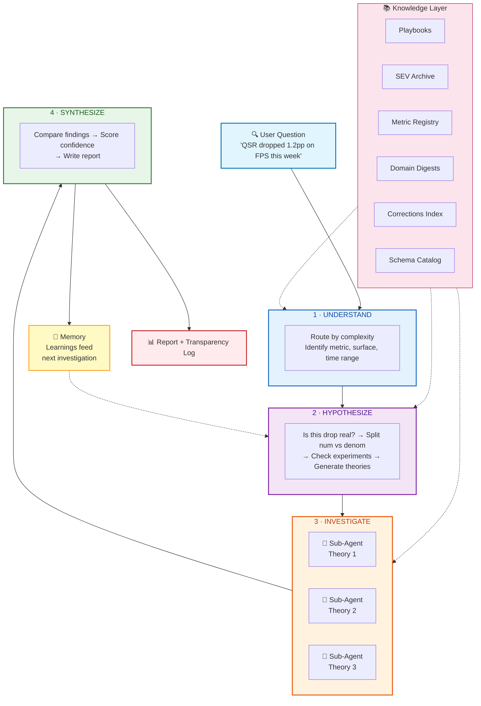
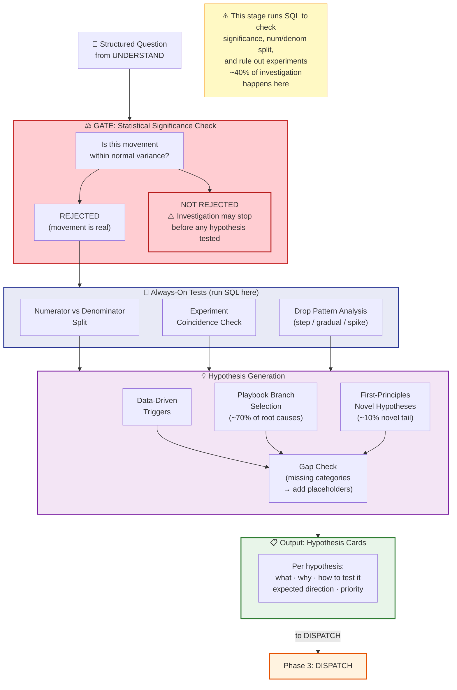
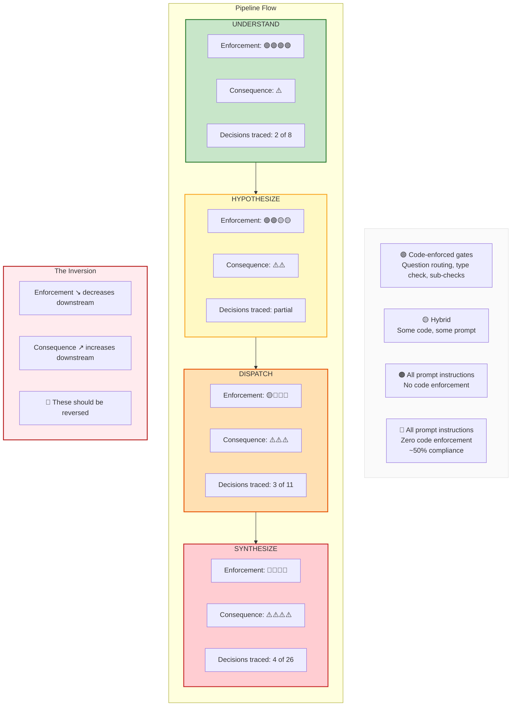
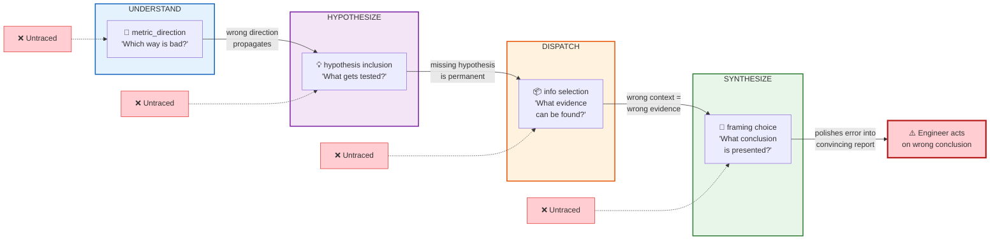
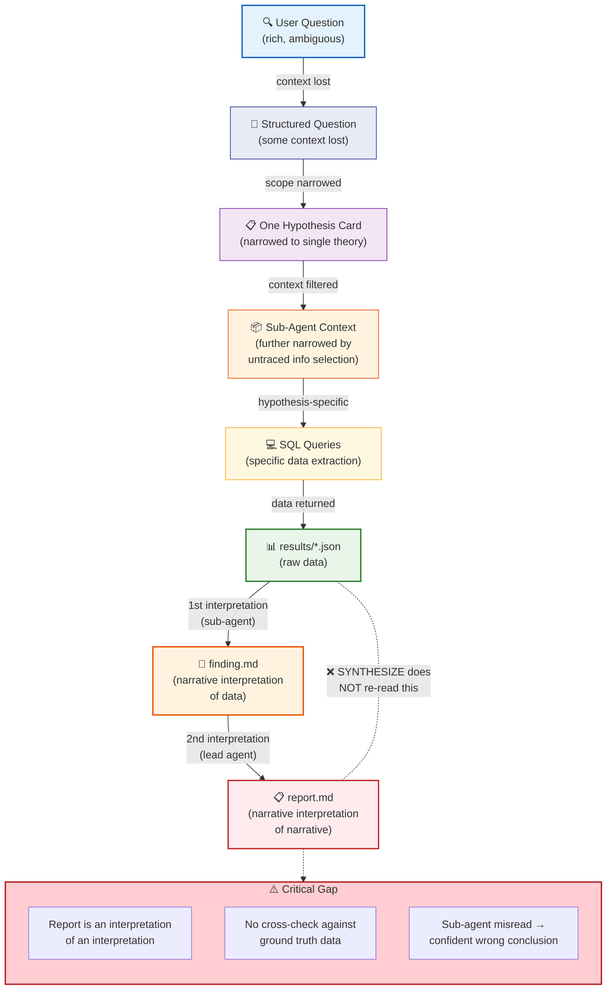
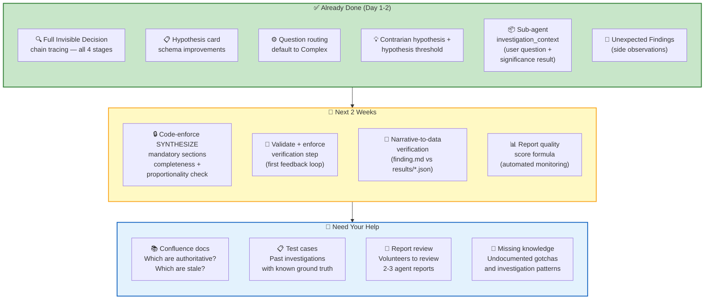
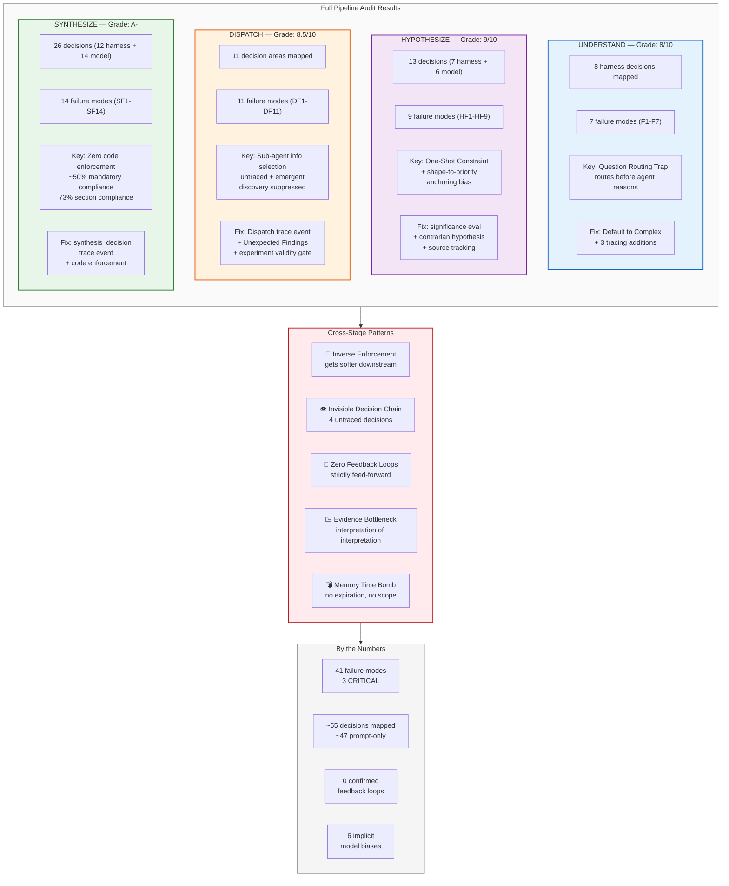

# Search Metric Analysis Agent: Tech Talk + Demo
## Presentation Script (with Embedded Diagrams)

**Audience:** Search Engineering — TLs, ICs (IC6-IC9), EMs, PM Lead
**Duration:** 45 min (31 min talk + demo, 14 min discussion)
**Goal:** Get honest SME feedback on the agent system to improve investigation quality and build the right eval framework
**Tone:** Technical peer review, not a pitch. You're asking experts to help you make this better.

---

## PRE-TALK SETUP

Before you start:
- Have Session 118 investigation trace open (or your most recent traced investigation)
- Have the agent system ready for a live demo (or a recorded walkthrough as backup)
- Diagrams are embedded below at their cue points — render from Mermaid or export as images
- Print/share the "Feedback Questions" handout (end of this script) so people can think while you talk

---

## SECTION 1: THE PROBLEM (2 min)

> *[Open conversationally. No slides yet — just talk.]*

"Thanks for making time. I'm going to show you something we've been building, and I need your honest reaction — especially where it gets things wrong.

Here's the problem. Metric investigation is genuinely complex. Even experienced engineers — people who know these systems inside out — can spend hours to days on a single drop. It crosses sub-domains, it requires checking experiments, denominators, cohort shifts, deployment timing, all against tables that are documented unevenly or not at all. QSR alone is a composite of Confluence 40%, Jira 40%, 3P 20% — and a drop could originate in any of those layers, or in the interaction between them.

The complexity isn't about anyone being slow. It's that the search space is huge and the data relationships are subtle. When SAIN coverage drops while success rate rises, that's a selection effect — and recognizing it requires domain knowledge that takes time to build and apply.

The question we've been exploring: **can an agent system automate the structured legwork — the denominator decomposition, the experiment coincidence checks, the standard playbook hypotheses — so experienced engineers spend their time on the hard thinking instead of writing the same baseline SQL for the 50th time?**

Not replacing investigation. Producing a first draft for you to review. I'm going to show you how it works, then I'm going to show you where it breaks, because that's where I need your expertise."

---

## SECTION 2: HOW IT WORKS + TOKEN EFFICIENCY (5 min)

> *[Show Diagram 1. Keep this brisk — your audience knows search investigation, so you're mapping their mental model to the system architecture, not teaching them investigation.]*

### 📊 DIAGRAM 1: Pipeline Architecture

"The system follows a four-stage pipeline that mirrors how you'd actually investigate:

**UNDERSTAND** — Takes the input, figures out which metric, which surface, what time range, how big the movement is. Routes the question by complexity. Think of it as the first 10 minutes of your investigation — when you're getting oriented.

**HYPOTHESIZE** — Generates hypotheses about what caused the movement. This isn't random — it runs an significance check first (is this drop even real, or normal variance?), does a numerator-vs-denominator split, checks if an experiment launched at the same time, then generates specific hypotheses from our domain playbooks plus first-principles reasoning. If you've investigated SAIN coverage drops, you know the usual suspects — the system knows them too, because we encoded them.

**DISPATCH** — Sends each hypothesis to a sub-agent that runs SQL, checks the data, and produces a finding with a verdict: SUPPORTED, REJECTED, or INCONCLUSIVE. Multiple hypotheses investigated in parallel.

**SYNTHESIZE** — Takes all the findings, reconciles them, picks the winning explanation, assigns a confidence grade with a 7-factor framework, and writes a report with a PM summary, detailed analysis, confidence assessment, and recommended next steps.

**And here's the part that makes it get smarter over time: memory.**

The system has two memory layers. **Global memory** — stored in global.md — accumulates investigation learnings. Every time the system completes an investigation, SYNTHESIZE writes around 5 learnings: things like 'SAIN selection effect causes apparent coverage drops when success rate rises' or 'check DLC interaction when SAIN moves on 3P surface.' Next investigation, HYPOTHESIZE reads those learnings and uses them to generate better hypotheses. The system learns from its own work.

**Personal memory** tracks individual users — what domain they typically work in, which surfaces and metrics they care about, and what they've investigated before. If you're the engineer who always looks at Ranking metrics on Desktop, the system knows that. It uses this to adjust hypothesis priority and knowledge loading — your domain focus shapes what gets investigated first and what context gets loaded.

Personal memory is earlier-stage than global memory — it's partially working but not as mature. Global memory is the fully operational layer; personal memory is the personalization layer we're still building out.

Both layers feed into the knowledge stack alongside the static sources — Confluence-sourced domain digests, the corrections index, playbooks, SEV archive. The difference is that memory *grows* with use. The static knowledge tells the system what search metrics are and how they work. Global memory tells the system what it's learned from past investigations. Personal memory tells the system what *you* specifically care about.

I'll show you what this looks like in practice in the demo — and then I'll tell you why it worries me."

> *[Pause briefly]*

"That's the clean version. Before I show you a real one, let me address something I know is on people's minds.

> *[Token efficiency — address directly. This audience shares limited Cursor and in-house agent budgets.]*

"I know token budget is a real concern — we all share limited Cursor and in-house coding agent capacity. Yes, building this agent burned tokens. But *running* it is architecturally designed to be efficient. Three things:

**Tiered routing, not one-size-fits-all.** Not every question gets the full treatment. The system routes by complexity before anything expensive loads. Simple questions get 5K tokens and metric-registry only. Complex SEV investigations get the full knowledge stack — playbooks, SEV archive, corrections index. You pay for what you need.

**Selective knowledge loading.** The system doesn't dump everything into context. It loads domain knowledge based on the metric family and complexity tier. Fast-changing domains like Third-Party Connectors are always-loaded — because the cost of stale context is higher than the token cost. More stable domains are demand-loaded only when relevant.

**Pre-scoped sub-agent context.** The Lead Agent reads the full knowledge modules — corrections.yaml at around 400 lines, global.md at around 270 lines — during HYPOTHESIZE. But sub-agents don't get the full dump. They receive only curated excerpts relevant to their specific hypothesis. A typical sub-agent investigation uses about 17K-32K tokens against a 55K budget. There's headroom, not waste.

The architecture is designed so a standard investigation is efficient, and only complex multi-hypothesis SEV investigations use the full token budget — which is appropriate because those are the investigations that take your engineers the longest to do manually."

> *[Transition to demo]*

"Now let me show you a real one."

---

## SECTION 3: LIVE DEMO (15 min)

> *[Run a live investigation OR walk through Session 118 results. Whichever is more reliable — a failed live demo will distract from your actual message. If live, pick a recent metric movement you already know the answer to, so you can evaluate the output in real time.]*

> *[Option A: Live demo — pick a known metric movement]*

"I'm going to run this against [specific recent metric movement — ideally one your audience investigated manually]. Let's see what it does."

> *[While it runs, narrate what's happening at each stage. Point out the trace events as they emit.]*

> *[Option B: Session 118 walkthrough]*

"This is Session 118 — an investigation into a QSR movement we did as a test case. Let me walk you through what the system produced."

**Key things to highlight during demo:**

**1. The hypothesis set** — "Here's what it generated. it checked whether the numerator or denominator drove the change, tested whether the drop is statistically real. Then it generated specific hypotheses for [X]. I want you to look at this list and think: *would you have tested these same things? What's missing?*"

> *[If someone asks how hypothesis generation actually works internally, show Diagram 2:]*

### 📊 DIAGRAM 2: HYPOTHESIZE Internal Flow (keep in reserve — show if asked)

**2. A sub-agent finding** — "Here's what the SAIN coverage sub-agent found. It ran [these SQL queries], got [these results], and concluded [verdict]. Look at the evidence table — the 7-factor confidence breakdown. Does this match how you'd interpret this data?"

**3. The final report** — "Here's the synthesis. PM summary at the top, detailed analysis, confidence grade [X]. Root cause conclusion: [Y]."

**4. The memory write** — "Now watch what happens at the end. The system writes learnings to global.md — here are the 5 learnings from this investigation. [Read them out loud.] These feed into the next investigation's hypothesis generation. This is how the system accumulates domain knowledge from its own work.

And notice — this investigation was run by [user/you], who typically investigates [domain]. The system's personal memory layer tracked that, which influenced which hypotheses got prioritized and which knowledge got loaded first. If a different engineer with a different domain focus ran the same question, the hypothesis ordering might look different — the system adapts to who's asking, not just what's being asked. Personal memory is still early-stage, but the intent is that the system learns both *what search metrics do* and *what each engineer cares about*.

But memory is also where risk builds up — I'll get to that."

**5. The trace output** — "This is new. For the first time, we can see the full decision chain — what UNDERSTAND classified, why these hypotheses were generated, what context each sub-agent received, and how SYNTHESIZE framed the conclusion. Before this, all of that was invisible."

> *[Then pause and be direct:]*

"So — quick gut check before I go deeper. For those of you who know this metric area: **does this conclusion look right? And if not, where did it go wrong?**"

> *[Take 2-3 minutes of initial reactions. Don't be defensive. Write down what people say. This is the most valuable part of the presentation.]*

---

## SECTION 4: THE HONEST ASSESSMENT (5 min)

> *[This is where you build credibility. You're not selling — you're showing that you've done rigorous self-assessment and you know exactly where the weaknesses are.]*

"Okay, let me tell you what we know about where this breaks. We ran a formal audit — 20 structured questions across all four stages, reviewed at an IC9 architect level. Here's what we found.

**The overall verdict: the investigation logic is strong, but the control architecture is inverted.**"

### 📊 DIAGRAM 3: The Inverse Enforcement Problem

> *[Show this first — the green-to-red gradient makes the inversion immediately visceral.]*

"The system gets *less careful* as the stakes get *higher*. The stage that produces the report you'd act on has zero code enforcement and about 50% compliance on its own mandatory checks. That's the central problem.

**Three specific things that worry me most:**"

---

**[Hold up one finger]** "**One: The Invisible Decision Chain.**"

### 📊 DIAGRAM 4: The Invisible Decision Chain

"Each stage has one highest-leverage decision that's completely untraced. In UNDERSTAND, it's which direction is 'bad' for the metric. In HYPOTHESIZE, it's which hypotheses make the cut. In DISPATCH, it's what context each sub-agent receives. In SYNTHESIZE, it's how to frame the root cause narrative. These four decisions form a chain — each inherits all upstream errors. If the first one is wrong, the system constructs a *convincing wrong answer* at the end. Before this audit, we couldn't see any of them. Now we can trace all four — that's what the new tracing shows."

---

**[Two fingers]** "**Two: The One-Shot Constraint.** The system generates hypotheses once. If the right root cause isn't in that initial set, the investigation fails. There's no mechanism to go back and try different hypotheses. Every Search engineer knows the feeling of 'my first theory was wrong, let me try something else.' This system can't do that yet."

---

**[Three fingers]** "**Three: The Evidence Bottleneck.**"

### 📊 DIAGRAM 5: Evidence Bottleneck

"SYNTHESIZE reads the sub-agent's *narrative summary* of query results — not the raw data itself. The final report is an interpretation of an interpretation. If a sub-agent subtly misreads the data — confuses correlation with causation, misreads the direction of a metric — SYNTHESIZE can't catch it because it never sees the numbers directly."

> *[Pause. Let this land.]*

"And one more — connected to the memory system I showed you in the demo."

**[Four]** "**Four: The Memory Time Bomb.** Remember those 5 learnings the system wrote to global.md? That's a powerful feature — the system accumulates domain knowledge from its own investigations. But right now, the implementation is dangerous at scale.

Learnings are append-only. No expiration — something written six months ago carries the same weight as yesterday's learning. No confidence score — a learning from a HIGH-confidence investigation and a LOW-confidence one look identical. No scope boundary — a learning about SAIN on FPS could get applied to SAIN on a completely different surface.

And the user gate — where you approve the writes — is illusory safety. You're approving learnings you can't meaningfully evaluate because you'd need to re-run the investigation to verify them.

The real risk is a feedback loop: if the system writes an over-generalized learning, it biases future hypotheses. Future investigations converge on expected patterns. More confirmatory learnings get written. Cycle repeats. At our current scale — dozens of investigations — this is manageable. At hundreds of investigations, global.md becomes a self-reinforcing echo chamber where the system increasingly finds what it expects to find.

We have a design for fixing this — metadata on every learning (timestamp, confidence, scope, investigation ID), periodic review triggers for old learnings, and eventually a quality scoring system. But it's not built yet, and I want you to know that."

> *[Now wrap up Section 4]*

"I'm telling you this because I don't want you to evaluate this as a finished product. It's a strong prototype. The investigation logic works. The domain knowledge is real — it knows about SAIN decomposition patterns, denominator effects, experiment attribution, the things you all deal with. And the memory system means it genuinely gets smarter over time. But it has structural gaps that matter, and I need people who actually investigate search metrics to tell me which gaps matter *most*."

---

## SECTION 5: WHERE I NEED YOUR EXPERTISE (3 min)

> *[Transition from presentation to discussion. Frame specific, answerable questions.]*

"I have three specific areas where your expertise would change the quality of this system. I'm not asking for general feedback — I have specific questions.

### Ask #1: Help Me Find the Right Confluence Docs

The agent's domain knowledge comes from Confluence documentation synthesized into digests across six sub-domains: Query Understanding, Retrieval, Ranking, Interleaver, Third-Party Connectors, and Search Experience. The quality of the agent's investigation is directly bounded by the quality of those source docs.

Here's my problem: I know our documentation hygiene is... uneven. Some Confluence pages are current and authoritative. Some haven't been updated in a year. Some critical knowledge was never written down at all. And I don't always know which is which — you do.

My question: **For your domain, which Confluence docs are the source of truth?** If you were onboarding a senior engineer to investigate metric movements in your area, which 3-5 pages would you send them to first?

Just as important: **which docs are stale?** If a doc looks current but the system behavior has changed since it was written, the agent will confidently apply outdated knowledge. That's worse than having no doc at all. A quick 'this page is stale as of [date]' is enormously valuable.

And: **what's never been documented?** The investigation patterns, the known gotchas, the 'when you see X, always check Y first' — the stuff that lives in your head or in Slack threads but not in any Confluence page. Even a bullet list in a new page gives me something to synthesize.

This matters especially for Third-Party Connectors, where the domain moves fast enough that even recent docs may be out of date. But it applies to every sub-domain. The more accurate the source docs, the better the agent investigates — and improving these docs benefits your whole team, not just the agent.

### Ask #2: Evidence Interpretation

> *[Show a sub-agent finding — the evidence table, the verdict]*

My question: **When you look at this sub-agent's interpretation of the data, does it match how you'd read the same results? Where would you disagree?**

The most dangerous failure mode we identified is 'hallucinated evidence' — the sub-agent reports numbers that don't exactly match the raw query output. We're building automated checks for that. But the subtler problem is *correct numbers, wrong interpretation*. The data is right, but the conclusion drawn from it is wrong. That's a domain expertise problem, and I can't evaluate it without people who know what these metrics actually mean.

### Ask #3: Evaluation Test Cases

This is the meta-question. **How should we measure whether this system is giving good answers?**

We're looking at our SEV archive — 24 historical incidents where we know what the root cause was. The plan is to replay those through the system and compare.

My question: **Are there specific past investigations that would be good test cases? Ones where the root cause was surprising, or where the investigation took a wrong turn before finding the right answer?** Those are exactly the cases that will stress-test this system in useful ways."

---

## SECTION 6: WHAT'S NEXT (1 min)

> *[1 minute max. Show the roadmap diagram and hit the three bullets. Don't narrate — let the diagram speak.]*

### 📊 DIAGRAM 6: Fix Roadmap

"Based on the audit, here's what we're doing next:

**Already done:**
- Full decision chain tracing across all four stages — you saw this in the demo
- Schema improvements for hypothesis tracking

**Next two weeks:**
- Code enforcement on SYNTHESIZE — mandatory report sections, completeness checks, does-the-evidence-match-the-drop-size validation. The stuff that's currently 50% compliance becomes 100%.
- Sub-agent context improvements — so they actually know the user's question and the movement significance when they investigate.
- Narrative-to-data verification — automated check that the numbers in the report match the actual query results.

**What I need from you:**
- Point me to the authoritative Confluence docs for your domain — and flag which ones are stale or missing entirely
- Past investigations that would make good test cases — especially ones where the root cause was non-obvious
- Volunteers who'd be willing to review 2-3 agent-generated reports and tell me where they're wrong. Takes about 20 minutes each. That human calibration is the most valuable thing for building a reliable eval.

I'll share a feedback form after this, and I'm happy to do 1:1 deep dives with anyone who has specific domain feedback — especially on Ranking, Third-Party Connectors, and Query Understanding, where the Confluence coverage is thinnest."

---

## SECTION 7: DISCUSSION (14 min)

> *[Open the floor. Keep Diagram 7 ready — if someone asks "how bad can it get?" or wants to see the full scope of findings, show it.]*

### 📊 DIAGRAM 7: Audit Results Summary (keep in reserve — show if asked)

**Seed questions if the room is quiet:**

- "For the TLs — when your team investigates a metric drop, what's the first Confluence page they go to? And when was the last time it was updated?"

- "For the ICs who've investigated [specific recent incident] — if you'd seen this system's report, would you have trusted it? What would have made you suspicious?"

- "For PMs — the report has a PM summary at the top. Is that the right level of detail? What would you need to see to act on it without reading the full analysis?"

- "For anyone — what's a gotcha in your domain that trips up people who don't know the system? The kind of thing that's never been written down but everyone on the team knows? That's exactly what this agent is missing."

---

## FEEDBACK FORM (share after talk)

> *[Print or share digitally. Keep it short — 5 questions max or people won't fill it out.]*

### Search Metric Analysis Agent — Feedback

**1. Confluence docs:** For your domain, what are the 3-5 authoritative Confluence pages for understanding metric movements? Are any of them stale?

**2. Missing knowledge:** What investigation patterns or known gotchas in your domain have never been documented in Confluence? Even a bullet list helps.

**3. Interpretation quality:** On a scale of 1-5, how much would you trust the sub-agent's interpretation of query results in the domain you know best? What would increase your trust?

**4. Test cases:** Can you name 1-2 past investigations (SEV or non-SEV) that would be good stress tests? Especially ones where the root cause was non-obvious.

**5. Report trust:** If this report landed in your inbox for a metric movement in your area, what's the first thing you'd check to decide whether to trust it?

---

## DELIVERY NOTES

**What to do:**
- Be specific. Use real metric names (QSR, SAIN, DLC, FPS), real incident examples, real SQL patterns. This audience lives in specifics.
- Show vulnerability. The audit findings are your credibility — you know what's broken and you're being honest about it. Search engineers respect that more than a polished demo.
- Take notes on feedback visibly. When someone gives you a hypothesis gap or a test case idea, write it down where they can see. It signals that you're actually listening, not just performing listening.
- Let the demo speak. If the system produced a reasonable analysis, the demo will generate more useful discussion than any slide. If it got something wrong, even better — debug it live with the room.

**What NOT to do:**
- Don't oversell. Never say "this replaces investigation" — say "this produces a first draft for you to review." The audience will immediately disengage if they feel their expertise is being devalued.
- Don't be vague about limitations. "We're still improving it" is weak. "SYNTHESIZE has zero code enforcement and 50% compliance on mandatory checks — here's our plan to fix that" is strong.
- Don't show 30 slides. Search engineers want to see the system work and then poke at it. Minimize slides, maximize demo and discussion time.
- Don't defend when criticized. If someone says "this hypothesis set is missing X" — that's a win, not an attack. Say "that's exactly what I need — can you tell me more about when you've seen X cause metric movements?" and write it down.
- Don't ask "what do you think?" Ask "is this right?" and "what's missing?" — specific questions get specific answers.

**Timing discipline:**
- Sections 1-2 (problem + architecture + tokens): 7 min max. Your audience gets it. Don't over-explain.
- Section 3 (demo): 15 min. This is the core — expanded for memory walkthrough and initial reactions.
- Section 4 (honest assessment): 5 min. Tighter delivery — four points, no long pauses.
- Section 5 (asks): 3 min. Confluence ask is the lead — others follow fast.
- Section 6 (next steps): 1 min. Show roadmap diagram, done.
- Section 7 (discussion): 14 min. Protect this time — start on time even if earlier sections run long.

If you're running long, cut in this order: Section 6 first (show diagram, skip narration — email next steps), then trim Section 1 (they know the problem — go to 1 min). **Never cut from the demo or discussion.** If you're behind by Section 4, tighten to three fingers (drop Memory Time Bomb — save for discussion if someone asks).

---

## APPENDIX: DIAGRAM FLOW DURING TALK

| Section | Diagram | Purpose |
|---|---|---|
| Section 2: How It Works | **Diagram 1: Pipeline Architecture** (simplified) | Audience grasps 4-stage flow + memory loop in 5 seconds |
| Section 3: Demo (if asked) | **Diagram 2: HYPOTHESIZE Internal Flow** | Reserve — show if someone asks how hypothesis generation works |
| Section 4: Honest Assessment (opener) | **Diagram 3: Inverse Enforcement Problem** | Green→red gradient makes inversion visceral |
| Section 4: First finger | **Diagram 4: Invisible Decision Chain** | Four red "Untraced" labels → "Engineer acts on wrong conclusion" |
| Section 4: Third finger | **Diagram 5: Evidence Bottleneck** | The "❌ does NOT re-read" crossing is the key visual |
| Section 6: What's Next | **Diagram 6: Fix Roadmap** | Done / Next / Need Your Help — keep visible during discussion |
| Section 7: Discussion (if asked) | **Diagram 7: Audit Results Summary** | Reserve — full scope of findings for deep-dive questions |

**Core flow (always show):** 1 → 3 → 4 → 5 → 6
**Reserve (show if asked):** 2, 7

---

## APPENDIX: KEY NUMBERS TO HAVE READY

If someone asks for specifics during discussion, these are the grounded data points from the audit:

| Metric | Value | Source |
|---|---|---|
| Total failure modes catalogued | 41 across all stages | Full audit |
| CRITICAL/Terminal failure modes | 3 (HF1, DF4, SF-9) | Audit Q4 per stage |
| SYNTHESIZE mandatory compliance | ~50% (Session 118) | Session 118 empirical |
| Required report sections present | 73% (8 of 11) | Session 118 empirical |
| Harness decisions traced | 2 of 8 (UNDERSTAND), varies by stage | Audit Q1 per stage |
| Structural feedback loops | 0 confirmed | Cross-stage analysis |
| Playbook coverage estimate | 70% match, 20% partial, 10% novel | Agent self-assessment |
| Agent self-audit quality | A- to A across 20 questions | IC9 review |
| Code-enforced decisions (DISPATCH+SYNTH) | 0 | Audit finding |
| Implicit model biases identified | 6 (in HYPOTHESIZE) | Audit Q2 |
| Sub-agent token utilization | ~17K-32K of ~55K budget | DISPATCH review Q3e |
| Domain sub-areas covered | 6 (QU, Retrieval, Ranking, Interleaver, 3P, SearchExp) | Architecture |
