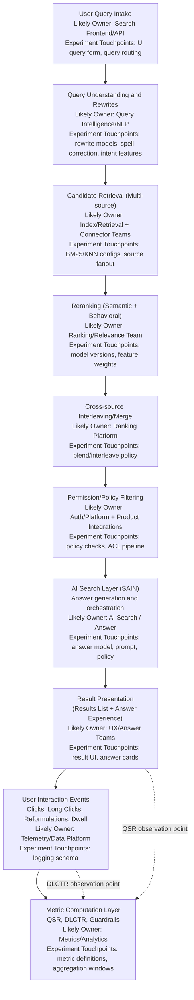

# Architecture Findings Brief: Enterprise Search Debugging Context

## 1) Title + Metadata
- Document: `search-system-findings-brief.md`
- Author: Data Science / Search Quality
- Date: 2026-02-07
- Status: Draft v1
- Source links:
  - Atlassian Engineering, *Unraveling Rovo search relevance*: https://www.atlassian.com/blog/atlassian-engineering/unraveling-rovo-search
  - Atlassian AI, *How Atlassian continuously improves Rovo Search quality*: https://www.atlassian.com/blog/artificial-intelligence/rovo-search-quality

## 2) Purpose and Scope
This brief captures inferred system behavior and debugging implications for Search Quality metrics (especially QSR and DLCTR). It is designed as a context artifact for the PRD and for faster analyst triage.

Out of scope:
- Final RCA algorithm design
- Final service/API implementation details
- Final ownership model and on-call process design

### AI Search (SAIN) Intro
- AI Search (SAIN) is the answer-generation and answer-orchestration layer on top of retrieval and ranking outputs.
- SAIN likely synthesizes evidence into direct answer experiences, which can change click behavior even when ranked results are similar.
- Because SAIN can shift how users complete tasks (answer consumption vs. clicking results), it must be treated as a first-class stage for QSR and DLCTR debugging.
- Key implication: metric movement may come from SAIN quality or answer policy changes, not only from rewrite/retrieval/ranking shifts.

## 3) Major Workflow Graph (Mermaid)

## 4) System Characteristics That Create Debugging Complexity
- Distributed ownership across stages: a single metric change may involve multiple teams and release trains.
- Multi-objective optimization: relevance, answer quality, and engagement objectives can trade off.
- AI answer mediation via SAIN: answer quality/policy shifts can alter behavior independently of core ranking quality.
- Permission/filtering side effects: visibility shifts can look like relevance regressions in topline metrics.
- Connector heterogeneity: source-specific schema and freshness variation cause segment-confounded movement.
- Personalization and cohort variance: user/context-sensitive ranking can hide localized regressions.
- Composition/interleaving effects: cross-source blending can move depth/click behavior without clear single-stage faults.

## 5) Why QSR and DLCTR Are Hard to Debug (Inferred)
- Stage-level confounding: rewrite, retrieval, rerank, and interleaving changes can produce similar metric signatures.
- Position bias and depth sensitivity: DLCTR can move because ranking/interleaving depth changes, even when raw relevance seems stable.
- Composite metric masking: QSR-like success can improve from answer engagement while click-based behavior worsens (or vice versa).
- SAIN policy masking: direct-answer exposure can reduce clicks (DLCTR down) while task completion may improve for some cohorts.
- Topline masking: localized regressions (connector, locale, query class, permission cohort) may cancel out in aggregate.
- Release/experiment overlap: concurrent experiments across teams make temporal attribution ambiguous.

## 6) Failure Taxonomy (Actionable v1)
| Failure class | Likely stage(s) | Metric signature (QSR/DLCTR and guardrails) | Fast validation checks | Likely owning team(s) |
|---|---|---|---|---|
| Query rewrite drift | Query understanding/rewrite | QSR down on ambiguous/long-tail queries; DLCTR mixed; reformulation up | Compare rewrite output diffs on fixed query set; bucket by query intent class | Query Intelligence / NLP |
| Retrieval coverage loss | Candidate retrieval | QSR down and DLCTR down; recall proxies down; zero-result rate up | Candidate-set size and source coverage deltas by connector/query class | Retrieval / Connector |
| Reranker miscalibration | Reranking | DLCTR down with stable/improving recall; rank-depth clicks shift deeper | Offline re-score with previous model; feature importance and score distribution shift | Ranking / Relevance |
| Interleaving policy shift | Cross-source merge | DLCTR down from deeper click depth; QSR flat/mixed; source mix shifts | Source contribution and position share before/after; blend-policy diff | Ranking Platform |
| Permission filtering regression | Permission/policy filtering | QSR down for specific tenant/cohort; accessible-result guardrail drops | Pre/post-filter candidate counts; ACL decision error rate by product | Auth/Platform + Integrations |
| Answer path cannibalization/quality issue | Result presentation + answer experience | QSR mixed; DLCTR down while answer-engagement rises (or vice versa) | Split metrics by answer-shown cohorts; answer quality labels vs click outcomes | Answer / UX / Relevance |
| SAIN generation/policy regression | AI Search (SAIN) | QSR down in answer-shown cohorts; DLCTR mixed/down; reformulation up after answer view | Compare SAIN-on vs SAIN-off cohorts; answer quality judgments; policy/version diffs | AI Search / Answer |
| Telemetry/metric pipeline issue | Interaction logging + metric layer | Abrupt QSR/DLCTR jumps without plausible behavioral correlate | Schema/version change audit; missing-event rates; backfill/replay checks | Data Platform / Metrics |

## 7) Debugging Hypothesis Playbook
Ordered triage flow:
1. Verify data integrity and instrumentation.
- Check freshness, completeness, schema changes, and event volume parity.
2. Localize by segment/time/surface.
- Slice by query class, connector/source, locale, tenant/cohort, device/surface.
3. Isolate stage effects.
- Evaluate rewrite, retrieval, rerank, interleaving, permissions, SAIN, and answer path separately.
4. Cross-check release and experiment timelines.
- Align metric inflection points with deployment/experiment windows across teams.
5. Escalate with an evidence packet.

Minimum evidence packet fields for handoff:
- Incident ID and timeframe
- Metrics moved (QSR, DLCTR, relevant guardrails) with effect size and uncertainty
- Affected segments (top positive/negative contributors)
- Stage-level suspects and disconfirming checks performed
- Linked experiments/releases and confidence rating
- Owner recommendation and immediate next action

## 8) Instrumentation and Observability Gaps (Inferred)
| Gap (inferred) | Why it matters | Impact | Effort |
|---|---|---|---|
| Missing stable query/session IDs across stages | Prevents deterministic stage-to-metric joins | high | medium |
| Weak lineage from result shown -> click -> long click | Blocks precise DLCTR attribution to ranking/interleaving decisions | high | medium |
| Incomplete exposure logging for answer experience | Makes QSR decomposition between answer and click paths ambiguous | high | medium |
| Limited SAIN policy/version stamps in interaction logs | Prevents direct attribution of metric movement to SAIN changes | high | low |
| Limited per-stage experiment annotation in logs | Increases cross-team attribution latency | high | low |
| Sparse permission pre/post-filter counters | Hides ACL-induced regressions behind relevance symptoms | medium | medium |
| Connector-level freshness/coverage telemetry gaps | Obscures retrieval-side root causes | medium | medium |
| No unified incident evidence artifact schema | Slows escalation and increases repeated analyst work | medium | low |

## 9) Assumptions and Confidence
Assumptions:
- Architecture understanding is inferred from public Atlassian materials and generalized enterprise-search patterns.
- Internal implementations, metric formulas, and ownership boundaries may differ.
- QSR/DLCTR definitions may include company-specific nuances not publicly documented.

Confidence by inference area:
- Multi-stage distributed pipeline shape: high
- Confounding and ownership fragmentation as root debugging pain: high
- Specific failure taxonomy mapping to your internal teams: medium
- Exact metric-signature behavior under each failure class: medium
- Instrumentation gap list applicability to your environment: medium

## 10) PRD Reference Instructions
Use this brief together with the PRD when:
- Grounding architecture context before RCA design
- Designing failure-mode coverage and triage flow
- Defining observability requirements and cross-team handoff expectations

PRD integration note:
- The PRD should reference this brief as a companion context document for system understanding and debugging assumptions.
